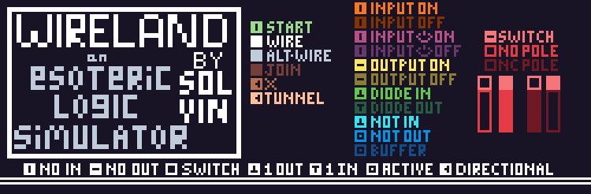

# wireland

An esoteric logic simulator inspired by TTL.

## Installation

1. Install Crystal
2. `shards install`
3. Install Raylib from `lib/raylib-cr/rsrc` or install raylib from source
4. `shards build app`

## Usage

Run `./bin/app` and drag and drop palette and png files into the window.

## I did this

- [Ian Rash](https://github.com/sol-vin) - creator and maintainer

## Other Credits

###Golem Script(Font) 
Developed by Common Opera for use in Fall 2020’s “Variations on Coda to Yellow Sky (Im/Perfect Dawn: Repeat)”, available at https://commonopera.itch.io/variations-on-coda-to-yellow-sky-imperfect-dawn-repeat.
